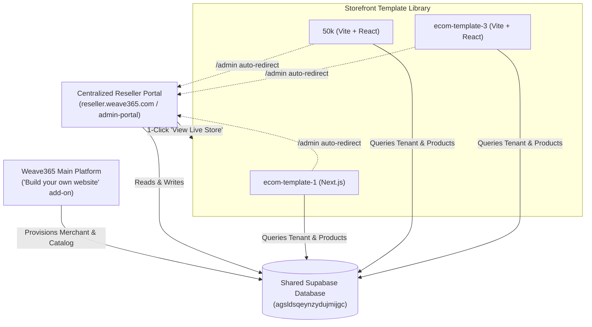

# Weave365 Ecosystem & Multi-Template Architecture

> **Purpose**: This document provides complete architectural and business context for anyone (including future AI assistant sessions) working on the Weave365 template ecosystem.

---

## 1. Executive Summary & Product Context

* **Company/Platform**: **Weave365** (`weave365.in` / `weave365.com`) is a B2B handloom silk saree manufacturer and reseller enablement platform in India.
* **Core Add-on Feature**: **"Build your own website"** (hosted on the main Weave365 platform).
  * Enables silk saree resellers, boutique owners, and entrepreneurs to launch their own branded e-commerce storefront in minutes without code.
  * Resellers choose from a library of pre-built, high-converting templates.
  * Storefronts are pre-populated with Weave365’s wholesale saree catalog.
  * Resellers set their own profit margins/markups on top of wholesale prices.
  * Orders and product inquiries route directly to the reseller’s WhatsApp business number.

---

## 2. Directory Structure in `/home/aban/Dev/templates`

```text
/home/aban/Dev/templates/
├── ecom-template-1/       # Template A: Modern Minimalist Luxury (Next.js 14 App Router)
├── 50k/                   # Template B: High-Conversion Boutique (Vite + React Router)
├── ecom-template-3/       # Template C: Heritage Atelier Luxury (Vite 8 + React 19)
└── admin-portal/          # Centralized Reseller Portal (reseller.weave365.com)
```

---

## 3. The 3 Storefront Templates Explained

All three repositories serve as **pure, customer-facing storefronts** provided as template choices in the Weave365 "Build your own website" catalog:

### Template 1: `ecom-template-1`
* **Framework**: Next.js 14 (App Router) + TypeScript + Tailwind CSS.
* **Aesthetic**: Sleek, modern minimalist editorial layout with dark mode accents, server-side rendering, and dynamic product filtering.
* **GitHub Repository**: `https://github.com/abanzubair/ecom-template-1` (branch `main`).

### Template 2: `50k`
* **Framework**: Vite + React + TypeScript + Tailwind CSS + Lucide Icons.
* **Aesthetic**: Ultra-fast single-page boutique with fluid micro-interactions, responsive carousel showcases, and rapid client-side hydration.
* **GitHub Repository**: `https://github.com/abanzubair/50k` (branch `main`).

### Template 3: `ecom-template-3`
* **Framework**: Vite 8 + React 19 + TypeScript + Tailwind CSS + Lucide Icons.
* **Aesthetic**: "Atelier Handlooms" heritage aesthetic using Cormorant Garamond serif headings, slide-over cart drawer, and WhatsApp bag checkout.
* **GitHub Repository**: `https://github.com/abanzubair/e-com-template-3.git` (branch `main`).

---

## 4. How the Templates are Linked Together

Despite having distinct frameworks (Next.js vs. Vite) and different visual designs, all three templates are tightly coupled into the Weave365 network through a **shared backend and multi-tenant protocol**:



### A. Shared Supabase Database
All templates point to the same Supabase project:
* **Supabase URL**: `https://agsldsqeynzydujmijgc.supabase.co`
* **Key Tables**:
  1. `boutique_tenants`:
     * Stores boutique profile: `id`, `slug`, `store_name`, `custom_domain`, `contact_whatsapp`, `currency`, `profit_margin_percent`, `is_active`, `owner_id`.
  2. `boutique_products`:
     * Master saree catalog with `wholesale_price` (Weave365 base cost), `retail_price` (customer facing price), `profit_margin_percent`, `is_active`, and images.
  3. `boutique_orders`:
     * Customer order and WhatsApp inquiry logs captured whenever a buyer clicks "Order via WhatsApp" on any template.

### B. Universal Multi-Tenant Resolution
Each template can resolve which boutique to display using 3 mechanisms:
1. **Custom Domain**: If the merchant sets `custom_domain` (e.g. `shop.radhikasarees.com`), the template queries `boutique_tenants` by domain.
2. **Subpath Slug**: Visiting `sitename.com/:slug` (e.g. `/50k` or `/radhika-sarees`) dynamically fetches and displays that boutique's products and brand name.
3. **Environment Default**: In single-tenant deployments, `NEXT_PUBLIC_RESELLER_SLUG` or `VITE_DEFAULT_TENANT_SLUG` defines the default store.

---

## 5. Centralized Reseller Management (`reseller.weave365.com`)

To eliminate code duplication and keep storefront bundles featherweight, **the admin panel is completely externalized**:

* **Project**: `/home/aban/Dev/templates/admin-portal`
* **Target Domain**: **`reseller.weave365.com`**
* **Role**:
  * Boutique owners and resellers log into this single portal.
  * They can claim or switch between multiple managed boutique stores.
  * They edit retail prices, customize profit margins (e.g. Wholesale ₹4,000 + 20% = Retail ₹4,800), and toggle catalog visibility.
  * They review and respond to incoming WhatsApp inquiries.
  * They configure custom domain DNS CNAME records pointing to `reseller.weave365.com`.
  * A top-bar **"View Live Store"** button opens the merchant's live storefront in their chosen template.
* **Storefront Template Redirection**:
  * In `ecom-template-1`, `50k`, and `ecom-template-3`, navigating to `/admin` immediately redirects to `https://reseller.weave365.com?store=<slug>`.
  * No admin code or admin dependencies exist inside the storefront templates.

---

## 6. Rules for Future Development Sessions

1. **GitHub Push Rule**: **NEVER push code to GitHub without explicit user permission.** Always ask first.
2. **Design Craft Standard (Impeccable)**:
   * Keep designs understated, quiet, and refined.
   * Zero eyebrow/kicker badges on headers.
   * Zero oversized metric cards with bright colored icon squares.
   * Tabular numerals (`tabular-nums`) for currency and metrics.
   * Fast, responsive, accessible layouts.
3. **Storefront Isolation**: Keep templates strictly as customer-facing applications. All admin/merchant management features belong in `admin-portal`.
